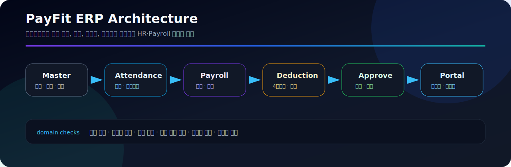

# PayFit ERP

[](https://github.com/sunwoo8478/ERP/actions/workflows/ci.yml)


급여 업무의 전체 흐름을 하나의 도메인 모델로 구현한 HR·Payroll ERP입니다. 회사와 직원 기준정보부터 근태, 급여 계산, 4대보험·세금 공제, 승인, 명세서 발급, 이체 자료, 리포트, 임직원 포털까지 연결합니다.




## 빠르게 보기

| 구분 | 내용 |
| --- | --- |
| 핵심 도메인 | 회사, 조직, 직원, 근태, 급여 실행, 명세서, 리포트 |
| 계산 흐름 | 기준급여 → 월할 → 비과세 → 4대보험 → 원천세 → 실지급액 |
| 백엔드 | Kotlin, Spring Boot, Spring Data JPA, Spring Security |
| 프런트엔드 | React, TypeScript, Vite, Axios |
| 문서 | [Architecture](./docs/ARCHITECTURE.md), [Payroll Rules](./docs/PAYROLL_RULES.md), [Operations](./docs/OPERATIONS.md) |

## 프로젝트 목표

PayFit ERP는 단순 CRUD가 아니라 급여 업무의 상태와 계산 규칙을 중심으로 설계한 프로젝트입니다.

| 목표 | 설명 |
| --- | --- |
| 도메인 중심 설계 | 회사, 조직, 직원, 호봉, 근태, 급여 실행, 명세서 흐름을 분리 |
| 계산 규칙 반영 | 월할 계산, 비과세 한도, 법정 공제, 연장·야간·휴일근로수당 처리 |
| 업무 상태 관리 | 초안, 계산, 검토, 승인, 지급으로 이어지는 급여 실행 상태 전이 |
| 운영 가능성 | JWT 인증, 예외 응답 표준화, 빌드 검증, 환경 변수 기반 설정 |

## 핵심 기능

- 회사·조직·직급·호봉·직원 기준정보 관리
- 입사일 기준 월할 계산과 비과세 한도 처리
- 국민연금·건강보험·장기요양·고용보험 및 원천세 계산
- 연장·야간·휴일근로수당과 무급휴가 공제 반영
- 급여 실행의 초안 → 계산 → 승인 → 지급 상태 전이
- 급여명세서, 급여대장, 이체 파일, 이메일 발송
- 퇴직금·노무비·원천징수·연말정산 리포트
- JWT 기반 관리자 인증과 임직원 셀프서비스 포털

## 업무 흐름

| 단계 | 모듈 | 설명 |
| --- | --- | --- |
| 1 | Master Data | 회사, 조직, 직급, 호봉, 직원 기준정보 등록 |
| 2 | Attendance | 휴가, 연장근무, 무급휴가 등 근태 데이터 반영 |
| 3 | Payroll Run | 지급 월 기준 급여 실행 생성 및 계산 |
| 4 | Deduction | 4대보험, 원천세, 비과세 항목 계산 |
| 5 | Approval | 급여 실행 상태 검토 및 승인 |
| 6 | Slip & Portal | 명세서 발급, 이메일 발송, 임직원 포털 조회 |
| 7 | Reporting | 급여대장, 노무비, 원천징수, 연말정산 리포트 |

## 엔지니어링 포인트

```txt
domain      Company / Employee / Attendance / PayrollRun / PayrollSlip
security    Spring Security + JWT + BCrypt
database    PostgreSQL + UUID PK + indexed payroll tables
frontend    React 19 + TypeScript + Vite + Axios
quality     Gradle test + TypeScript build + GitHub Actions
```

| 관심사 | 구현 방향 |
| --- | --- |
| API 응답 | `ApiResponse`와 `GlobalExceptionHandler`로 응답 구조 표준화 |
| 인증 | JWT 필터 기반 인증 흐름과 BCrypt 비밀번호 해시 |
| 계산 | 급여 실행 단위로 지급 항목과 공제 항목을 분리 계산 |
| 데이터 | 회사별 직원번호 유니크, 급여 실행 월별 유니크, 주요 조회 인덱스 구성 |
| 프런트엔드 | API 클라이언트와 화면 페이지를 분리해 급여 실행/명세서 조회 흐름 구성 |

## 기술 스택

| 구분 | 기술 |
| --- | --- |
| Backend | Kotlin 2.3.21, Spring Boot 3.4.5, Spring Web, Spring Data JPA |
| Security | Spring Security, JWT, BCrypt |
| Database | PostgreSQL, UUID, SQL schema migration |
| Frontend | React 19.2, TypeScript 6, Vite 8, Axios |
| Build | Gradle, npm, GitHub Actions |

## 주요 모듈

```text
src/main/kotlin/com/payroll/
├── auth/             # JWT 인증·인가, 보안 설정, 초기 사용자 데이터
├── common/           # 공통 응답, 전역 예외 처리
├── company/          # 회사 기준정보
├── orgunit/          # 조직 구조
├── jobgrade/         # 직급·직위
├── salarystep/       # 호봉 기준 금액
├── employee/         # 직원 정보
├── employment/       # 재직 이력
├── attendance/       # 휴가·연장근무
├── payrollconfig/    # 급여 환경 설정
├── payrollrun/       # 급여 실행·계산
├── payrollslip/      # 명세서·급여대장·발송
├── severance/        # 퇴직금 계산
├── reporting/        # 노무비·원천징수·연말정산 리포트
└── portal/           # 임직원 셀프서비스 API
```

## 데이터 모델 요약

| 테이블 | 역할 |
| --- | --- |
| `company`, `org_unit` | 회사와 조직 기준정보 |
| `job_grade`, `salary_step` | 직급, 직위, 호봉별 기준 급여 |
| `employee`, `salary_standard` | 직원 정보와 개인별 급여 기준 |
| `insurance_rate` | 연도별 4대보험 요율 |
| `payroll_run` | 월별 급여 실행 단위 |
| `payroll_slip`, `payroll_item` | 개인별 명세서와 지급·공제 항목 |

## 실행 방법

### 사전 요구사항

- JDK 21
- Node.js 22+
- PostgreSQL 15+

PostgreSQL 데이터베이스를 준비하고 필요한 환경 변수를 설정합니다.

```bash
export DB_PASSWORD='your-database-password'
export JWT_SECRET='replace-with-at-least-32-random-characters'
export MAIL_USERNAME='optional-smtp-account'
export MAIL_PASSWORD='optional-smtp-password'
```

### 백엔드

```bash
./gradlew bootRun
```

API 서버는 `http://localhost:18080`에서 실행됩니다.

### 프런트엔드

```bash
cd frontend
npm ci
npm run dev
```

Vite 개발 서버는 `/api` 요청을 백엔드로 전달합니다.

## 검증

```bash
./gradlew test
cd frontend
npm ci
npm run build
```

## 보안 안내

운영 환경의 인증 정보는 반드시 환경 변수로 주입해야 합니다. 개발 기본값을 운영에 사용하지 말고, 비밀키 교체, DB 접근 제한, 환경별 SMTP 계정 분리를 적용해야 합니다.

## 더 보기

- [아키텍처 문서](./docs/ARCHITECTURE.md)
- [급여 계산 규칙](./docs/PAYROLL_RULES.md)
- [운영 체크리스트](./docs/OPERATIONS.md)
- [기여 가이드](./CONTRIBUTING.md)
- [보안 안내](./SECURITY.md)
