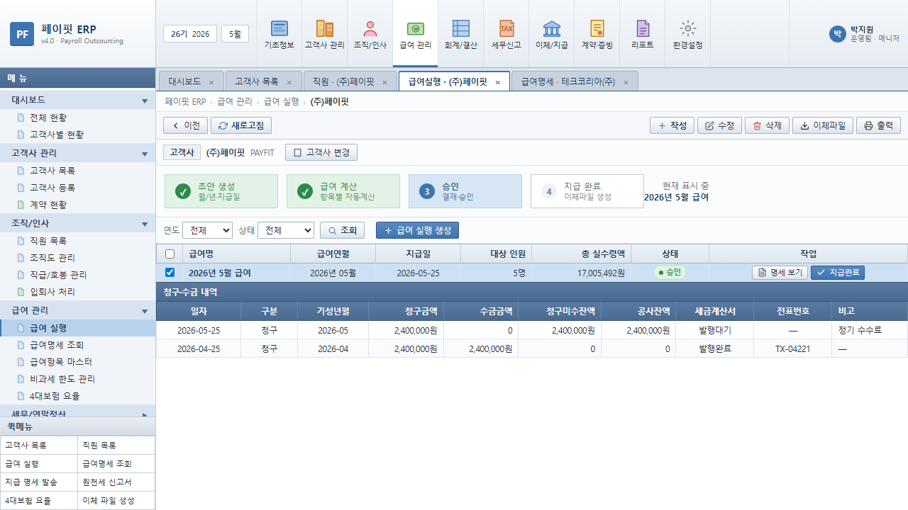
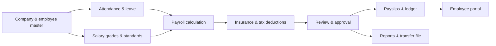

# PayFit ERP

[](https://github.com/sunwoo8478/ERP/actions/workflows/ci.yml)


급여 업무의 전체 흐름을 하나의 도메인 모델로 구현한 HR·Payroll ERP입니다. 회사와 직원 기준정보부터 근태, 급여 계산, 4대보험·세금 공제, 승인, 명세서 발급, 이체 자료, 리포트, 임직원 포털까지 연결합니다.



## Highlights

- 회사·조직·직급·호봉·직원 기준정보 관리
- 입사일 기준 월할 계산과 비과세 한도 처리
- 국민연금·건강보험·장기요양·고용보험 및 원천세 계산
- 연장·야간·휴일근로수당과 무급휴가 공제 반영
- 급여 실행의 초안 → 계산 → 승인 → 지급 상태 전이
- 급여명세서, 급여대장, 이체 파일, 이메일 발송
- 퇴직금·노무비·원천징수·연말정산 리포트
- JWT 기반 관리자 인증과 임직원 셀프서비스 포털

## Domain flow



## Tech stack

| Area | Technology |
| --- | --- |
| Backend | Kotlin, Spring Boot, Spring Data JPA, Spring Security |
| Data | PostgreSQL, schema-managed relational domain model |
| Authentication | JWT, BCrypt |
| Frontend | React 19, TypeScript, Vite, Axios |
| Build | Gradle, npm, GitHub Actions |

## Getting started

### Prerequisites

- JDK 21
- Node.js 22+
- PostgreSQL 15+

Create a PostgreSQL database and export the required secrets:

```bash
export DB_PASSWORD='your-database-password'
export JWT_SECRET='replace-with-at-least-32-random-characters'
export MAIL_USERNAME='optional-smtp-account'
export MAIL_PASSWORD='optional-smtp-password'
```

### Backend

```bash
./gradlew bootRun
```

The API starts on `http://localhost:18080`.

### Frontend

```bash
cd frontend
npm ci
npm run dev
```

The Vite server proxies `/api` to the backend.

## Major modules

```text
src/main/kotlin/com/payroll/
├── auth/            # JWT authentication and authorization
├── company/         # Tenant/company master data
├── employee/        # Employee and employment history
├── attendance/      # Leave and overtime workflows
├── payrollrun/      # Payroll lifecycle and calculation
├── payrollslip/     # Payslips, ledger and delivery
├── severance/       # Severance calculation
├── reporting/       # Labor cost, withholding and year-end reports
└── portal/          # Employee self-service APIs
```

## Verification

```bash
./gradlew test
cd frontend && npm run build
```

## Security note

All production credentials must be supplied through environment variables. Development defaults are not intended for deployment; rotate secrets, restrict database access, and configure SMTP credentials per environment.
