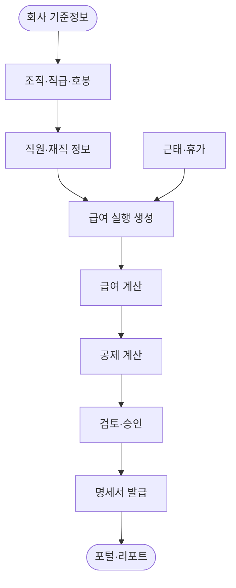

# Architecture

PayFit ERP는 급여 업무를 하나의 긴 트랜잭션으로 보지 않고, 기준정보와 실행 단위를 분리해서 관리합니다. 핵심은 “직원 기준정보가 바뀌어도 이미 확정된 급여 실행의 결과는 추적 가능해야 한다”는 점입니다.

## 업무 흐름



## 레이어 구조

| 레이어 | 역할 |
| --- | --- |
| Controller | API 요청과 응답을 담당 |
| Service | 급여 계산, 상태 전이, 업무 규칙 처리 |
| Repository | JPA 기반 데이터 접근 |
| Domain | 회사, 직원, 급여 실행, 명세서 등 핵심 모델 |
| Common | 공통 응답, 예외 처리 |
| Security | JWT 인증과 Spring Security 설정 |

## 주요 모듈

| 모듈 | 설명 |
| --- | --- |
| `company`, `orgunit`, `jobgrade` | 회사와 조직 기준정보 |
| `employee`, `employment`, `salarystandard` | 직원 정보와 급여 기준 |
| `attendance` | 휴가, 연장근무, 무급휴가 |
| `payrollrun` | 월별 급여 실행과 계산 |
| `payrollslip`, `payrollitem` | 개인별 명세서와 지급·공제 항목 |
| `reporting` | 급여대장, 노무비, 원천징수, 연말정산 |
| `portal` | 임직원 셀프서비스 API |

## 데이터 모델 기준

```text
company
  └─ org_unit
  └─ job_grade
       └─ salary_step
  └─ employee
       └─ salary_standard
       └─ attendance
       └─ payroll_slip
            └─ payroll_item
```

## 상태 관리

급여 실행은 상태를 기준으로 업무 흐름을 관리합니다.

| 상태 | 의미 |
| --- | --- |
| `DRAFT` | 실행 생성 후 계산 전 |
| `CALCULATED` | 직원별 명세서와 항목 계산 완료 |
| `REVIEWED` | 담당자 검토 완료 |
| `APPROVED` | 지급 전 최종 승인 |
| `PAID` | 지급 처리 완료 |

## 설계 메모

- 지급 항목과 공제 항목은 `payroll_item`으로 분리해 명세서 상세를 추적합니다.
- 월별 급여 실행은 회사, 연도, 월 기준으로 중복 생성되지 않게 제한합니다.
- 직원번호는 회사 단위로 유니크하게 관리합니다.
- 운영 인증 정보는 환경 변수로 주입합니다.
